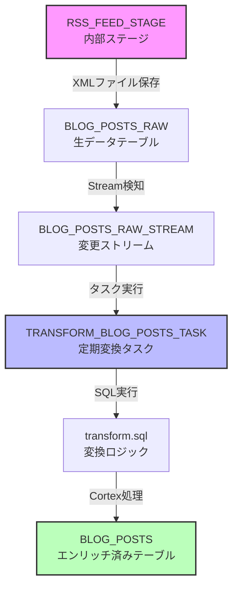

# MUED Snowflake AI App

RSS フィードを Snowflake に取り込み、AI による要約とベクトル検索を提供するアプリケーションです。

## ⚠️ Snowflake Cortex について

このアプリケーションは Snowflake Cortex の AI 機能を活用することを想定していますが、Cortex が利用できない環境でも動作します。

### Cortex が利用できない場合（デフォルト）
- ✅ RSS フィードの取得と保存
- ✅ テキストベースの検索機能
- ✅ 基本的な記事管理
- ❌ AI による要約生成
- ❌ ベクトル検索

### Cortex を有効化するには
1. Snowflake アカウントで Cortex が利用可能か確認
2. `app/streamlit_app.py` の `USE_CORTEX = True` に変更
3. データ変換に `src/transform.sql` を使用（`transform_basic.sql` の代わりに）

## 🚀 機能

- **RSS フィード自動取得**: note.com の RSS フィードを定期的に取得
- **AI 要約生成**: Snowflake Cortex による日本語要約（Cortex 有効時）
- **ベクトル検索**: 意味的に類似した記事を検索（Cortex 有効時）
- **Web UI**: Streamlit による検索インターフェース
- **REST API**: FastAPI による推薦エンドポイント

## 📋 必要条件

- Python 3.12
- Poetry（パッケージ管理）
- Snowflake アカウント（Cortex 機能が有効）
- GitHub アカウント（CI/CD 用）

## 🛠️ セットアップ

### 1. リポジトリのクローン

```bash
git clone https://github.com/yourusername/MPS-snowflake-sample01.git
cd MPS-snowflake-sample01
```

### 2. 初期設定

```bash
# Poetry のインストール（未インストールの場合）
curl -sSL https://install.python-poetry.org | python3 -

# プロジェクトの初期化
make init
```

### 3. 環境変数の設定

```bash
cp .env.example .env
# .env ファイルを編集して Snowflake の認証情報を設定
```

必要な環境変数:
- `SNOWFLAKE_ACCOUNT`: アカウント識別子
- `SNOWFLAKE_USER`: ユーザー名
- `SNOWFLAKE_PASSWORD`: パスワード
- `SNOWFLAKE_WAREHOUSE`: ウェアハウス名（デフォルト: COMPUTE_WH）
- `SNOWFLAKE_DATABASE`: データベース名（デフォルト: MUED）
- `RSS_FEED_URL`: RSS フィード URL

### 4. データベースのセットアップ

```bash
make setup-db
# 表示される SQL ファイルを Snowflake で実行してください
```

## 📊 使用方法

### RSS フィードの取得

```bash
make ingest
```

### Web UI の起動

```bash
make streamlit
# ブラウザで http://localhost:8501 を開く
```

### API サーバーの起動

```bash
make api
# API ドキュメント: http://localhost:8000/docs
```

### API の使用例

```bash
# ランダムな推薦を取得
curl "http://localhost:8000/recommend?student_id=123"

# キーワード検索による推薦
curl "http://localhost:8000/recommend?student_id=123&query=Python&limit=3"
```

## 🏗️ アーキテクチャ

```
┌─────────────┐     ┌──────────────┐     ┌──────────────┐
│  RSS Feed   │ --> │   Snowflake  │ --> │  Streamlit   │
│ (note.com)  │     │              │     │     UI       │
└─────────────┘     │ ┌──────────┐ │     └──────────────┘
                    │ │ RAW Data │ │
                    │ └──────────┘ │     ┌──────────────┐
                    │      ↓       │ --> │  FastAPI     │
                    │ ┌──────────┐ │     │    REST      │
                    │ │ Cortex   │ │     └──────────────┘
                    │ │ AI/ML    │ │
                    │ └──────────┘ │
                    │      ↓       │
                    │ ┌──────────┐ │
                    │ │Enriched  │ │
                    │ │  Data    │ │
                    │ └──────────┘ │
                    └──────────────┘
```

### データフロー

1. **取得**: RSS フィードを XML として取得
2. **保存**: `BLOG_POSTS_RAW` テーブルに生データを保存
3. **変換**: Snowflake タスクが定期的に実行
   - XML をパース
   - Cortex で要約生成
   - ベクトル埋め込み生成
4. **格納**: `BLOG_POSTS` テーブルに変換済みデータを保存
5. **検索**: ベクトル類似度検索で関連記事を取得

### Snowflake データベーススキーマ

```mermaid
erDiagram
    BLOG_POSTS_RAW {
        VARIANT xml "RSS XMLデータ"
        TIMESTAMP_NTZ fetched_at "取得日時"
        VARIANT _metadata "メタデータ"
    }

    BLOG_POSTS {
        VARCHAR id PK "記事ID（主キー）"
        VARCHAR title "記事タイトル"
        TEXT body_markdown "本文（Markdown）"
        VARCHAR level "公開レベル（free/premium/membership）"
        ARRAY tags "タグ配列"
        VARCHAR summary "AI生成要約"
        VECTOR emb "埋め込みベクトル（768次元）"
        VARCHAR url "記事URL"
        TIMESTAMP_NTZ published_at "公開日時"
        TIMESTAMP_NTZ created_at "作成日時"
        TIMESTAMP_NTZ updated_at "更新日時"
    }

    BLOG_POSTS_RAW_STREAM {
        VARIANT xml "変更されたXMLデータ"
        TIMESTAMP_NTZ fetched_at "取得日時"
        VARIANT METADATA$ACTION "変更アクション"
        BOOLEAN METADATA$ISUPDATE "更新フラグ"
    }

    BLOG_POSTS_RAW ||--o{ BLOG_POSTS_RAW_STREAM : "変更を追跡"
    BLOG_POSTS_RAW ||--o{ BLOG_POSTS : "変換・エンリッチ"
```

### ステージとタスク



## 🧪 開発

### テストの実行

```bash
make test
```

### コードフォーマット

```bash
make lint
```

### ステータス確認

```bash
make status
```

## 🚀 デプロイ

### GitHub Actions

以下のワークフローが自動実行されます：

- **日次 RSS 取得**: 毎日 12:00 JST に自動実行
- **PR チェック**: コード品質とテストの自動検証

### 必要な GitHub Secrets

リポジトリの Settings → Secrets で以下を設定：

- `SNOWFLAKE_ACCOUNT`
- `SNOWFLAKE_USER`
- `SNOWFLAKE_PASSWORD`
- `SNOWFLAKE_ROLE`
- `SNOWFLAKE_WAREHOUSE`
- `SNOWFLAKE_DATABASE`
- `SNOWFLAKE_SCHEMA`
- `RSS_FEED_URL`

## 📁 プロジェクト構造

```
.
├── api/                 # FastAPI アプリケーション
│   ├── main.py         # API エンドポイント
│   └── models.py       # Pydantic モデル
├── app/                # Streamlit アプリケーション
│   └── streamlit_app.py
├── src/                # コアロジック
│   ├── ingest.py       # RSS 取得と投入
│   ├── transform.sql   # データ変換 SQL
│   └── config.py       # 設定管理
├── tests/              # テストコード
├── sql/                # SQL スクリプト
│   ├── setup.sql       # DB セットアップ
│   └── create_task.sql # タスク作成
└── .github/workflows/  # GitHub Actions
```

## 🤝 コントリビューション

1. フォークする
2. フィーチャーブランチを作成 (`git checkout -b feature/amazing-feature`)
3. 変更をコミット (`git commit -m 'Add amazing feature'`)
4. ブランチにプッシュ (`git push origin feature/amazing-feature`)
5. プルリクエストを作成

## 📝 ライセンス

このプロジェクトは MIT ライセンスのもとで公開されています。

## 🆘 トラブルシューティング

### Poetry 関連の問題

#### `clear` コマンドが使えない
```bash
# Poetry PATH を設定
export PATH="$HOME/.local/bin:$PATH"

# または修正スクリプトを実行
bash scripts/fix_poetry_env.sh
```

#### Poetry shell が使えない
```bash
# Poetry 2.0+ では shell コマンドが廃止されました
# 代わりに以下を使用：
source $(poetry env info --path)/bin/activate
```

### Streamlit 関連の問題

#### ブラウザ自動起動エラー
```bash
# ラッパースクリプトを使用（推奨）
./scripts/run_streamlit.sh

# または手動でheadlessモードで起動
poetry run streamlit run app/streamlit_app.py --server.headless true
```

#### FileNotFoundError: 'open' エラー
これは Streamlit がブラウザを開こうとする際のエラーです。上記の headless モードで回避できます。

### 便利な設定

#### エイリアスの設定
```bash
# ~/.zshrc に以下を追加
alias pa='source $(poetry env info --path)/bin/activate'
alias prs='poetry run streamlit run app/streamlit_app.py --server.headless true'
alias pra='poetry run uvicorn api.main:app --reload'
```

#### Poetry 環境での作業
```bash
# 環境設定ファイルを読み込む
source .env.poetry
```

### Snowflake に接続できない
- アカウント識別子が正しいか確認（例: `abc12345.ap-northeast-1.aws`）
- ファイアウォール設定を確認

### Cortex 関数が使えない
- Snowflake アカウントで Cortex が有効になっているか確認
- 必要に応じて Snowflake サポートに問い合わせ
